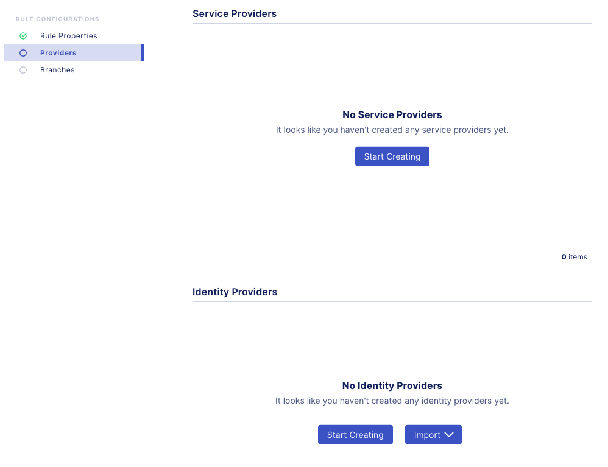
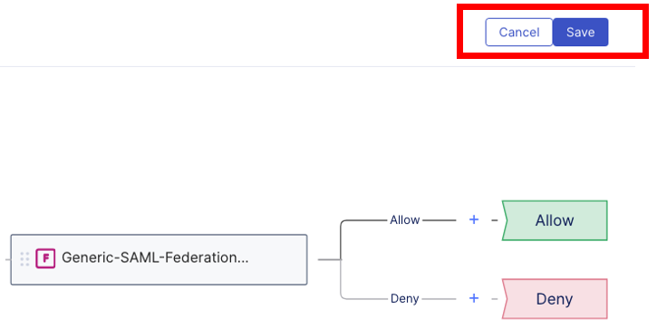

Lab 1.2 - Create an Access Security Policy
===========================================

Creating an security policy with signed SAML assertion
~~~~~~~~~~~~~~~~~~~~~~~~~~~~~~~~~~~~~~~~~~~~~~~~~~~~~~~~~

#. Access **BIG-IP Next Central Manager** if you're not already logged in.

.. image:: images/lab2-cmlogin.png

#. Click on the Workspace icon and select Security

.. image:: images/lab1-securitybtn.png

#. Under Security you will find all the security modules such as Access, WAF, and SSLO for example. The module may need to be enabled for the feature menu to show up on the Security list. For this lab we have already enabled Access module.

Click on **Access** from the Security menu, this should default to Policies.

.. image:: images/lab1-accessbtn.png

#. Click **Start Creating** button to create a new Access policy 

.. image:: images/lab1-createapbtn.png

#. This will open Access Visual Policy Design screen. Click on the pencil next to create new policy.

.. image:: images/lab1-createpolicypencil.png

#. In the **Create Policy** screen, this is where you set the different properties of the policy, such as, logging, language, Single Sign On, etc… Let’s start configuring the policy by setting a policy name and policy parameters.

In the **General Properties** screen set the following parameters, for the rest of the settings you may leave it as default.

- **Policy Name:** okta_signed_policy
- **Cookie Option:** check the **Secure** box
- Click **Continue** 

.. note:: As you continue the rest of the policy creation process, see the screen shot in each section for a visual example of the configuration.

.. image:: images/lab1-oktageneral.png

#. **Session Propertie** screen, you can specify session specific settings in this screen. For this lab we will keep the default. Click **Continue**.

.. image:: images/lab1-oktasession.png

#. **Logging screen** you can adjust the logging level to help with debugging or troubleshooting. For this lab we will keep the default settings. Click **Continue**. 

.. image:: images/lab1-oktalogging.png

#. **Single Sign On** screen, you can set the Single Sign On configuration with an IDP. For this lab we will not use any SSO. Click **Continue**.

.. image:: images/lab1-oktasso.png

#. **Endpoint Security** screen, you can setup Endpoint Security such as ensuring firewall is enabled on a client workstation before access is granted. For this lab we will not use this feature. Click **Continue**.

.. image:: images/lab1-oktaendpoint.png

#. **Resources** you can set additional capabilities and features such as Network Access, and Webtops in this screen. For this lab we will not use these capabilities. Click **Continue**.

.. image:: images/lab1-oktaresources.png

#. **Policy Endings** you can define additional policy ending logic as needed for your use case here. For this lab we will accept the default. Click **Finish**.

.. image:: images/lab1-oktapolicyendings.png

After clicking on Finish it should bring you back to the Create Policy screen. Now, we will use the Visual Policy Designer (VPD) to build the policy.

In Next Access we have two terms in the Visual Policy Designer (VPD); flows and rules, we set the flows in the VPD and within each flow we can define multiple rules.

.. image:: images/lab1-createpolicy2.png

#. Under **Flows**, drag and drop **Generic SAML Federation** flow to the VPD. You will need click on the little dots to the right of the flow type to grab the flow and drop into the VPD. 

.. image:: images/lab1-oktasaml.png

When dropping the flow type onto the VPD, you will want to make sure the flow type box is over the plus sign and the plus sign turns blue.

.. image:: images/lab1-oktasamldragndrop.png

The result should look like the following screen shot.

.. image:: images/lab1-oktasamldragndrop2.png

#. Click inside the Flow type box. This show 3 buttons; **Delete**, **Edit**, and **Collapse** buttons. Click on the **Collapse** button to start adding Rules to the Flow.

.. image:: images/lab1-oktaflowbox1.png

Clicking on the Collapse button will expand the SAML Federation Flow type box. 

.. image:: images/lab1-oktasamlflow1.png

.. note:: Noticed the title on the top left hand corner is Generic-SAML-Federation follow by a series of unique number. This can help identify which Flow you're currently viewing in VPD.

#. Click inside the **SAML-Federation** Rule box, and select the **Edit** button

.. image:: images/lab1-oktasamlrule1.png

This will open the SAML Federation Rule properties screen. Please follow the images below for each section.

#. In the **Rule Configuration**, **Rule Properties** screen, add **SAML-Federation-Okta-Rule** as the name of the rule, leave the rest as default. Click **Continue**.

.. image:: images/lab1-oktasamlrule2.png

#. In the **Rule Configuration**, **Providers** screen, this is where you can configure Service Provider and Identity Provider. 

#. For this lab, we will need to configure both a **Service Provider** and **Identity Provider**.

In the **Service Provider** section, click on the **Start Creating** button. 

.. image:: images/lab1-oktasamlrule3.png

#. In the **Add Service Provider** screen add the following parameters:

- **EntityID:** https://signed.example.com
- **Host:** https://signed.example.com
- **Check Want Signed Assertion** box
- Click **Save**

.. image:: images/lab1-oktasamlrule4.png

#. In the **Identity Provider** section, click on the **Start Creating** button. 

.. image:: images/lab1-oktasamlidentity.png

#. In the **Add Idnentity Provider** screen add the following parameters:

- **EntityID:** http://www.okta.com/exk93cs4on3gGVej44x7
- **SSO URL:** https://dev-818899.okta.com/app/dev-818899_signedexamplecom_1/exk93cs4on3gGVej44x7/sso/saml
- **Identity Provider’s Assertion Verification Certificate:** select the *okta_signed_cert* imported previously
- Click **Save**

#. Below is a summary of the completed Providers screen confirm you have both a Service Provider and Identity Provider configured, then Click **Continue**.

.. image:: images/lab1-oktasamlconfirm.png

#. In the **Branches** screen, keep the default. Click **Finish**.

.. image:: images/lab1-oktasamlrule6.png

#. This should bring you back to the Visual Policy Designer. Close the SAML flow by clicking on the **Collapse** icon.

#. In the SAML Flow, change the Allow flow ending from Deny to **Allow**.

.. image:: images/lab1-oktasamlrule17.png

#. Click **Save** button at the top right hand corner to save the policy. After the policy is saved, click **Cancel** to close the policy.

You have completed creating a security policy. Next we will deploy an Application and assigned the access policy. 