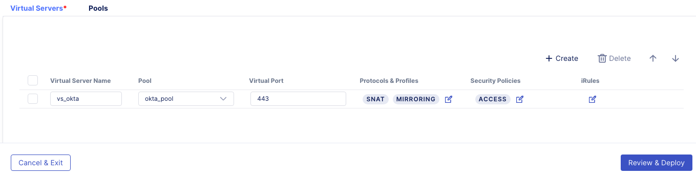
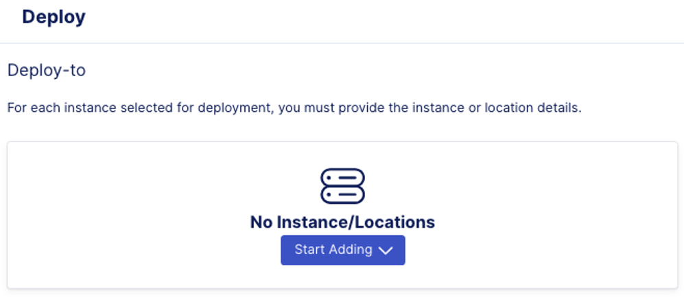
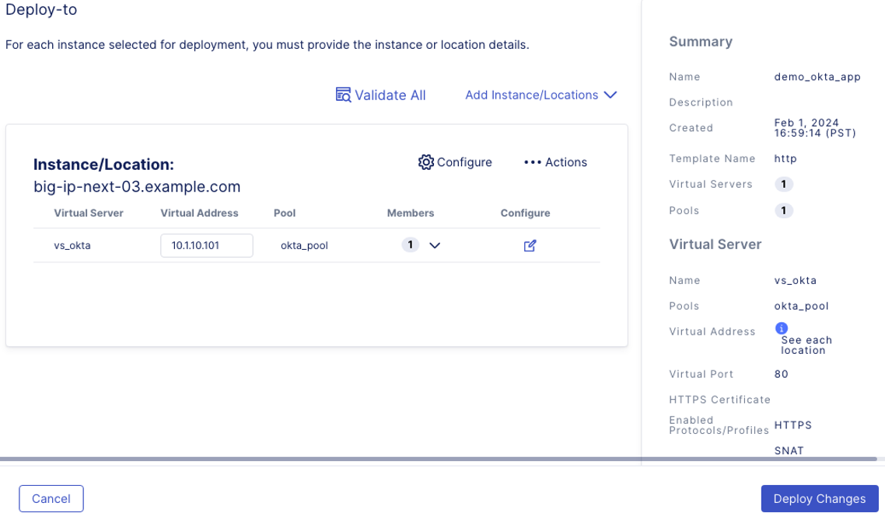

Lab 1.3 - Create an Application
=================================

Creating an application and assign an Access policy to the application.
~~~~~~~~~~~~~~~~~~~~~~~~~~~~~~~~~~~~~~~~~~~~~~~~~~~~~~~~~~~~~~~~~~~~~~~~

#. Access **BIG-IP Next Central Manager** if you're not already logged in.

.. image:: images/lab2-cmlogin.png

#. Click on the Workspace icon and select Application.

.. image:: images/lab3-app1.png

#. Click on **Start Adding Apps** button to create an Application.

.. image:: images/lab3-app3.png

#. In the **Add Application** screen, you can choose to create an application based on a template or create a standard application from scratch. In this lab, we will start with a **Standard** application.

In the Application Service Name type: demo_okta_app
Click **Start Creating**

.. image:: images/lab3-app4.png

#. In the Application Service Properties screen, click on **Start Creating** to start creating a virtual server.

.. image:: images/lab3-app5.png

#. In the Application Services Propertes screen, Virtual Servers tab, you will define the virtual servers, pools, and profiles. Let’s start with creating Pools.

.. image:: images/lab3-app6.png

#. Click on **Pools** tab, and Click on **Create** button.

.. image:: images/lab3-app7.png

#. Define the following pool properties:

- **Pool Name:** okta_pool
- **Load-Balancing Mode:** round-robin

.. image:: images/lab3-app8.png

#. Click on **Virtual Servers** tab, and define the following virtual server properties.

- **Virtual Server Name:** vs_okta
- **Pool:** okta_pool
- **Virtual Port:** 443

.. image:: images/lab3-app9.png

#. Click on the edit button under **Protocols & Profiles**.

#. In the **Protocols and Profiles**, tick the slider button for **Enable HTTPS (Client-Side TLS)**. This will enable the features under HTTPS. Click on the **Add** button under the **No Client-Side TLS** to add a certificate.

.. image:: images/lab3-app10.png

#. In the Add Client-Side TLS screen, provide the input the following information.

- **Name:** okta_signed_client_cert
- **RSA Certificate:** select from the drop down box, *self_demo.f5.com* cert
- Click **Save**

.. image:: images/lab3-app11.png

#. This should take you back to the **Protocols and Profiles** screen. Keep the rest of the settings as default. Click **Save**. 

.. image:: images/lab3-app12.png

#. This will take you back to the Virtual Server screen. Now we will attach the Access Policy we created previously to this application. Click on the edit button under **Security Policies**.

.. image:: images/lab3-app13.png

#. This will open the **Security Policies** screen. Slide the button next to **Use an Access Policy**. Under **Specify the Access Policy for this Application**, click the drop down box and select the *okta_signed_policy* created previously. Click **Save**.

.. image:: images/lab3-app14.png

#. After clicking **Save**, you should be returned to the Virtual Server property page. Click on **Review & Deploy** at the bottom right-hand corner. 

#. In the **Deploy-to** screen, this is where you define which BIG-IP Next instance to deploy the application. Click on **Start Adding** to select a BIG-IP Next Instance.

#. In the drop down box, select *big-ip-next-03.example.com*, then click on **Add to List** button.

.. image:: images/lab3-app17.png

#. Add **Virtual Address** *10.1.10.101* to associate with the vs_okta. 

.. image:: images/lab3-app18.png

#. Click on the drop down arrow under the **Members** column. This is where we will add the backend pool members to the virtual server.

.. image:: images/lab3-app19.png

#. In the okta_pool screen, click on **Add** Row, and enter the following information for the pool member.

- **Name:** backend_okta_signed
- **IP Address:** 10.1.20.6
- Click **Save**

.. image:: images/lab3-app20.png

#. Now you’re ready to Deploy your application. Click on **Deploy Changes** at the bottom right-hand corner.

#. Confirm in the pop up window that you’re deploy to big-ip-next-03.example.com instance.

.. image:: images/lab3-app22.png

Click on **Yes, Deploy**. 

#. You will get a status pop up window, and after a few seconds, the screen should refresh and show you the My Application Service dashboard, with a confirmation that Deployment Complete.

.. image:: images/lab3-app23.png
.. image:: images/lab3-app24.png

#. My Application Services Dashboard should show you one application has been deployed, and Health is Good. 

.. image:: images/lab3-app25.png

Yay! You have completed deploying an Application and have associated it with an Access policy. Let's move to the next step to test the Application you have just deployed.

