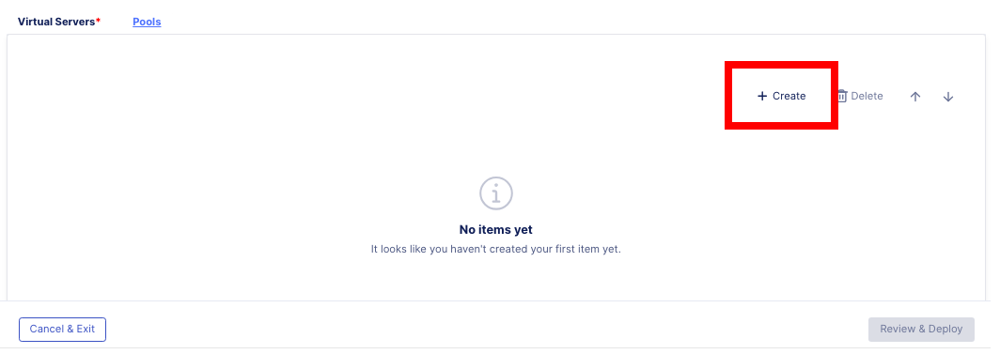

Lab 1.3 - Create an Application
=================================

Creating an application and assign an Access policy to the application.
~~~~~~~~~~~~~~~~~~~~~~~~~~~~~~~~~~~~~~~~~~~~~~~~~~~~~~~~~~~~~~~~~~~~~~~~

#. Access **BIG-IP Next Central Manager** if you're not already logged in.

.. image:: images/lab2-cmlogin.png

#. Click on the Workspace icon and select Application.

.. image:: images/lab3-app1.png

#. Click on **Start Adding Apps** button to create an Application.

.. image:: images/lab3-app3.png

#. In the **Add Application** screen, you can choose to create an application based on a template or create a standard application from scratch. In this lab, we will start with a **Standard** application.

In the Application Service Name type: demo_okta_app
Click **Start Creating**

.. image:: images/lab3-app4.png

#. In the Application Service Properties screen, click on **Start Creating** to start creating a virtual server.

.. image:: images/lab3-app5.png

#. In the Application Services Propertes screen, Virtual Servers tab, you will define the virtual servers, pools, and profiles. Let’s start with creating Pools.

.. image:: images/lab3-app6.png

#. Click on **Pools** tab, and Click on **Create** button.

#. Define the following pool properties:

- **Pool Name:** okta_pool
- **Load-Balancing Mode:** round-robin

.. image:: images/lab3-app8.png

#. Click on **Virtual Servers** tab, and define the following virtual server properties.

- **Virtual Server Name:** vs_okta
- **Pool:** okta_pool
- **Virtual Port:** 443

.. image:: images/lab3-app9.png

#. Click on the edit button under **Protocols & Profiles**.

#. In the **Protocols and Profiles**, tick the slider button for **Enable HTTPS (Client-Side TLS)**. This will enable the features under HTTPS. Click on the **Add** button under the **No Client-Side TLS** to add a certificate.

.. image:: images/lab3-app10.png

#. In the Add Client-Side TLS screen, provide the input the following information.

- **Name:** okta_signed_client_cert
- **RSA Certificate:** select from the drop down box, *self_demo.f5.com* cert
- Click **Save**

.. image:: images/lab3-app11.png

#. This should take you back to the **Protocols and Profiles** screen. Keep the rest of the settings as default. Click **Save**. 

.. image:: images/lab3-app12.png

