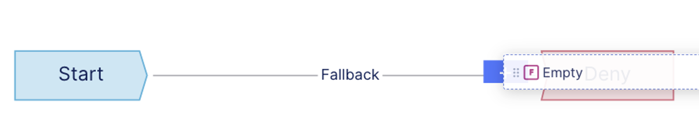
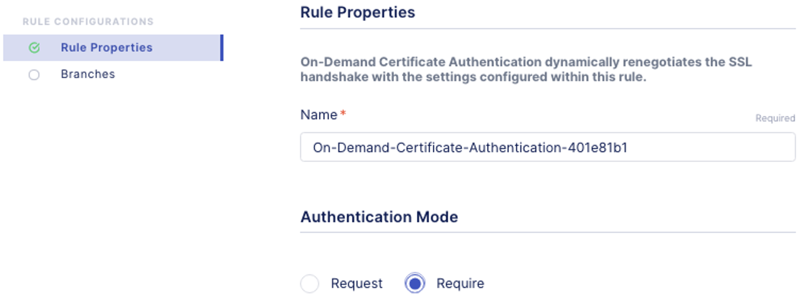
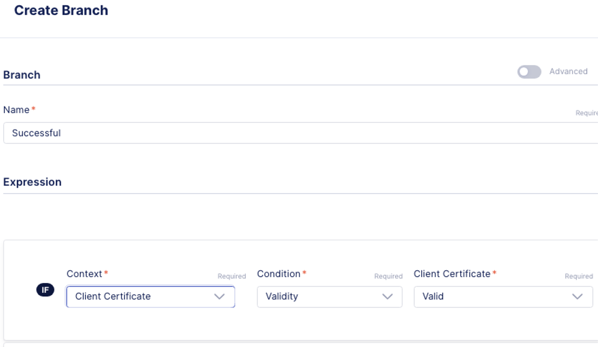
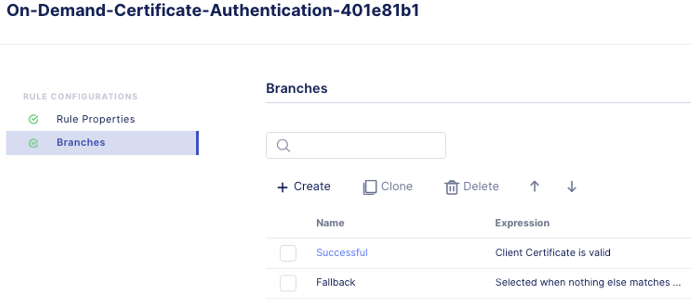
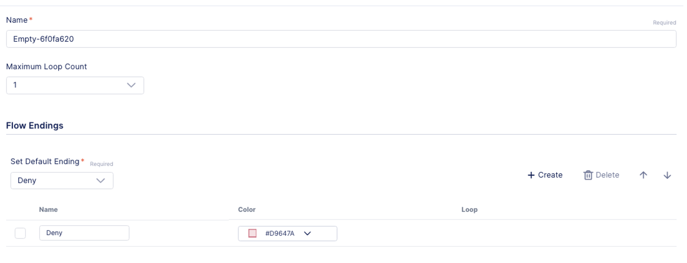

Lab 1.2 - Create an Access Security Policy
===========================================

Creating an security policy with signed SAML assertion
~~~~~~~~~~~~~~~~~~~~~~~~~~~~~~~~~~~~~~~~~~~~~~~~~~~~~~~~~

1. Access **BIG-IP Next Central Manager** if you're not already logged in.

.. image:: images/lab3-cmlogin.png
    :width: 600 px

2. Click on the Workspace icon and select Security

.. image:: images/lab3-securitybtn.png
    :width: 600 px
3. Click on **Access** from the Security menu, this should default to Policies.

.. image:: images/lab3-accessbtn.png
    :width: 600 px

4. Click **Start Creating** button to create a new Access policy 

.. image:: images/lab3-createapbtn.png
    :width: 600 px

5. This will open Access Visual Policy Design screen. Click on the pencil next to create new policy.

.. image:: images/lab3-createpolicypencil.png
    :width: 600 px

6. In the **Create Policy** screen, this is where you set the different properties of the policy, such as, logging, language, Single Sign On, etc… Let’s start configuring the policy Start Selecting policy name and adjust policy parameters.

In the **General Properties** screen set the following parameters, for the rest of the settings you may leave it as default.

- **Policy Name:** certAuth
- **Cookie Option:** check the **Secure** box
- Click **Continue** 

.. note:: As you continue the rest of the policy creation process, see the screen shot in each section for a visual example of the configuration.

7. In **Session Properties**, keep the default settings, click **Continue**.

.. image:: images/lab3-session.png
    :width: 600 px

8. **Logging screen** you can adjust the logging level to help with debugging or troubleshooting. For this lab we will keep the default settings. Click **Continue**. 

.. image:: images/lab3-logging.png
    :width: 600 px

9. **Single Sign On** screen, you can set the Single Sign On configuration with an IDP. For this lab we will not use any SSO. Click **Continue**.

.. image:: images/lab3-sso.png
    :width: 600 px

10. **Endpoint Security** screen, you can setup Endpoint Security such as ensuring firewall is enabled on a client workstation before access is granted. For this lab we will not use this feature. Click **Continue**.

.. image:: images/lab3-endpoint.png
    :width: 600 px

11. **Resources** you can set additional capabilities and features such as Network Access, and Webtops in this screen. For this lab we will not use these capabilities. Click **Continue**.

.. image:: images/lab3-resources.png
    :width: 600 px

12. **Policy Endings** you can define additional policy ending logic as needed for your use case here. For this lab we will accept the default. Click **Finish**.

.. image:: images/lab3-policyendings.png
    :width: 600 px

After clicking on **Finish** it should bring you back to the Create Policy screen. Now, we will use the Visual Policy Designer (VPD) to build the policy.

.. image:: images/lab3-createpolicy2.png
    :width: 600 px

13. Under **Flows**, drag and drop **Empty** flow to the VPD. You will need click on the little dots to the right of the flow type to grab the flow and drop into the VPD. 

.. image:: images/lab3-emptyflow.png
    :width: 600 px

When dropping the flow type onto the VPD, you will want to make sure the flow type box is over the plus sign and the plus sign turns blue.

The result should look like the following screen shot.

.. image:: images/lab3-emptyok.png
    :width: 600 px

14. Click inside the Flow type box. This show 3 buttons; **Delete**, **Edit**, and **Collapse** buttons. Click on the **Collapse** button to start adding Rules to the Flow.

.. image:: images/lab3-allthebtns.png
    :width: 600 px

15. On the left hand side menu, select the **R** (Rules) button, and scroll down on the **Rules** till you find **On-Demand Certificate Authentication**.

.. image:: images/lab3-rules1.png
    :width: 600 px

 16. Click and drag **On-Demand Certificate Authenticate** to the VPD.

.. image:: images/lab3-rules2.png
    :width: 600 px

17. Edit the **On-Demand Certificate** rule by clicking on the edit button.

.. image:: images/lab3-rules3.png
    :width: 600 px

18. In the **Rule Configurations**, **Rule Properties**, change **Authentication Mode** to **Require**. Click **Continue**.

19. In the **Rule Configurations**, **Branches** screen we will add another branch for a successful authentication. 

Click on **Create** button to add a new Branch 

.. image:: images/lab3-branches.png
    :width: 600 px

20. In the **Create Branch** screen, adjust the parameters to the following, and click **Save** when done. 

- **Name:** Successful
- **Context:** Client Certificate
- **Condition:** Validity
- **Client Certificate:** Valid

You should now have two branches in Successful and Fallback, see image below. Click **Finish**.

21. Click on the **Collapse** button to close the **Rules and Flow** box so you’re back to the main VPD. See image below for reference.

.. image:: images/lab3-branchclose.png
    :width: 600 px

22. Click on **Edit** button on the **Empty Flow** box. This will open up the **Empty Flow** property screen. 

23. We want to add another terminal or Flow Ending for an Allow policy if the certificate matches. 

- Click on **Create** to add another Flow Ending
- In the **Name** box type **Allow** 
- Select the color **#199D4D** (Green) for the Allow ending

.. image:: images/lab3-flowending.png
    :width: 600 px

 24. Save the policy and close the VPD by clicking on **Cancel**.

You have completed creating a security policy. Next we will deploy an Application and assigned the access policy. 