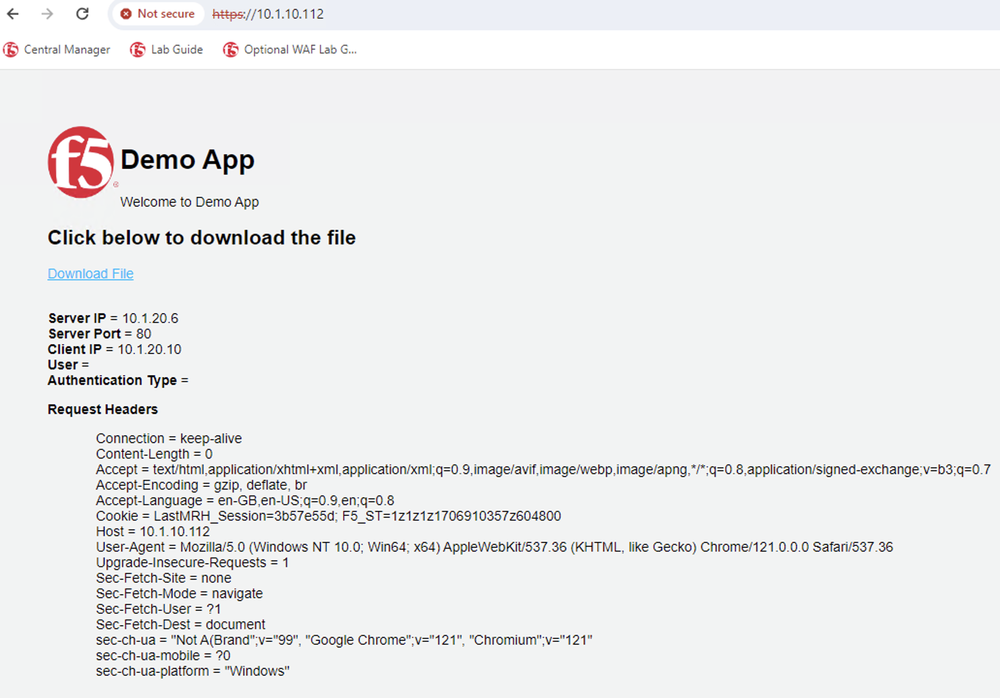

Lab 1.4 - Test Application
=================================

Test Connectivity to Application
~~~~~~~~~~~~~~~~~~~~~~~~~~~~~~~~~
1. Open a new Chrome browser or tab and type: https://10.1.10.112  

.. image:: images/lab3-security.png
    :width: 600 px

You may get a security warning **Your Connection is Not Private**, this is because we're using a self-signed certificate. It is safe to proceed. 

2. You will get a pop up to Select a certificate pop in the browser, verify it’s the ADDC CA certificate you have uploaded earlier, click **Ok**. 

3. You should see the F5 Demo App after a successful login. 

This concludes Lab 3 - Certificate Authentication.