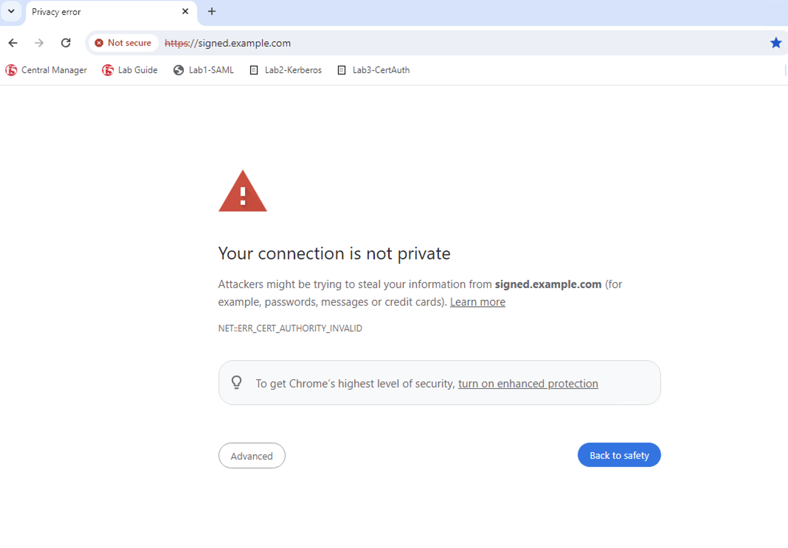
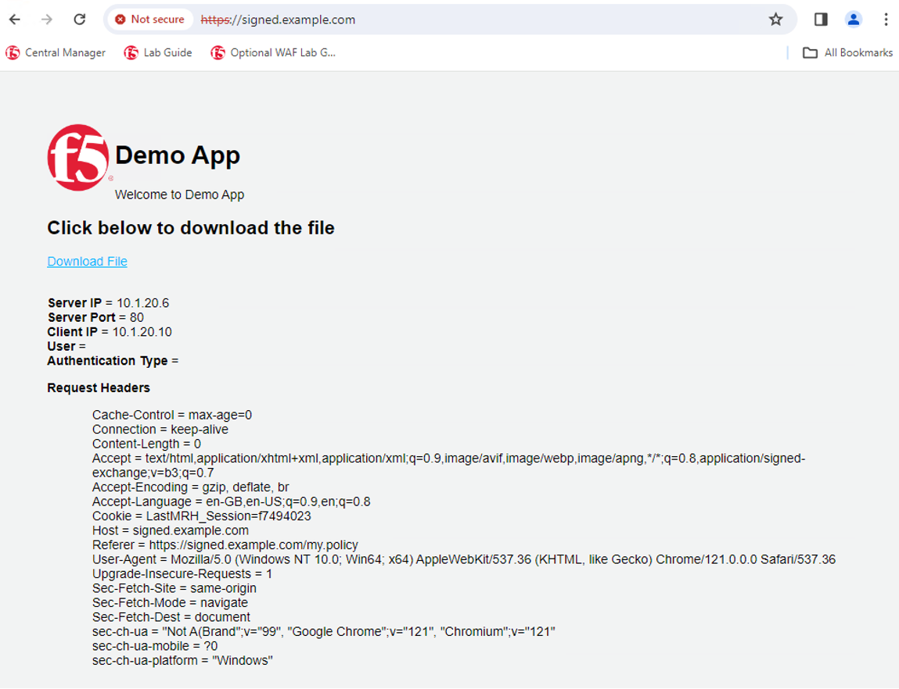

Lab 1.3 - Test Application
##########################

Test Connectivity to the Application
************************************

1. Open an RDP session to Windows-Client-Testing VM

2. In a new Firefox browser window type the following URL: https://signed.example.com

You may get a security warning **Your Connection is Not Private**, this is because we're using a self-signed certificate. It is safe to proceed. 

3. When prompted for Okta authentication enter the following username/password: user1/user1

.. image:: images/lab4-logon.png
    :width: 600 px

You should see the F5 Demo App after a successful login. 

This concludes Lab 1 - SAML Federation with Okta.