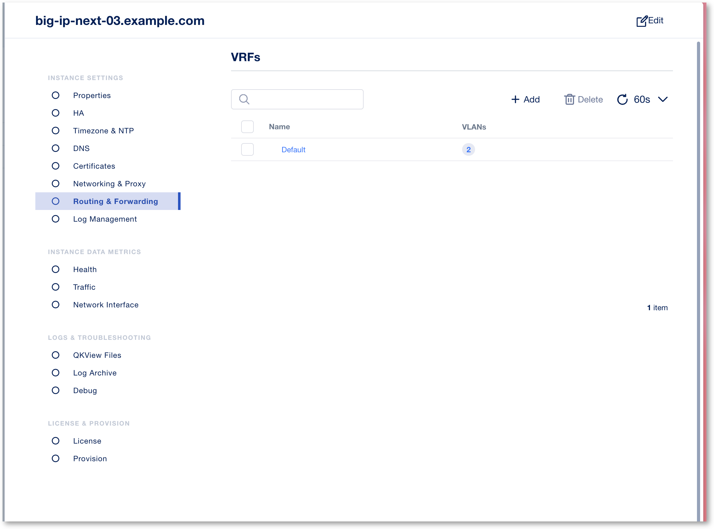

Lab 2.1 - Create DNS Resolver
#############################

Configuring a L3 DNS Resolver
*****************************

.. note:: In this lab, we are adding a Single Sign-on with Kerberos Constrained Delegation to authenticate users to the back-end application (IIS server). This requires to configure a DNS resolver so that Next Access can reach the Kerberos server (Active Directory)

1. Access **BIG-IP Next Central Manager** if you're not already logged in.

.. image:: images/lab2-cmlogin.png
    :width: 600 px

2. Click on the Workspace icon and select Infrastructure

.. image:: images/lab2-infrastructure.png
    :width: 600 px

3. In the My Instances dashboard, click on *big-ip-next-03.example.com* instance.

.. image:: images/lab2-myinstances.png
    :width: 600 px

4. This will open the Instance Settings screen. On the left side, click on **Routing & Forwarding**. Click on **Default** VRF. 

5. Enable **DNS Resolver** and add a new entry

* Name : global_f5_internal_net_resolver
* Forward Zone : create a new zone

  * forwardZone : . <- this is a period or single dot
  * nameserver : 10.1.1.6:53

.. image:: images/lab2-dnsresolver.png
    :width: 600 px

9. Click **Save** and **Save**, and then click **Cancel & Exit** to exit out of the Instance Setting screen.

This ends this section of the lab, onto the next. 