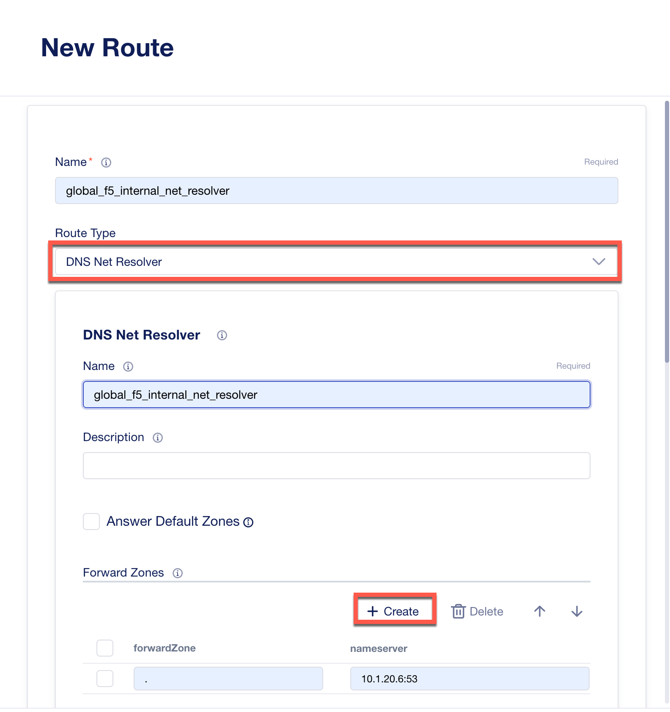
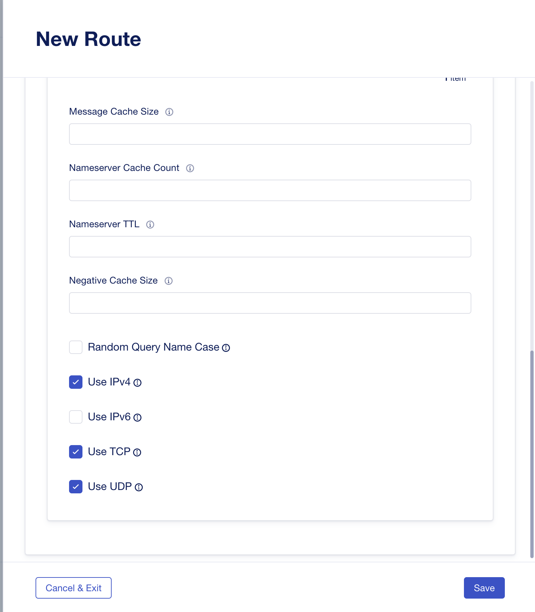

Lab 1.1 - Create DNS Resolver
===========================================

Configuring a L3 DNS Resolver
~~~~~~~~~~~~~~~~~~~~~~~~~~~~~~

1. Access **BIG-IP Next Central Manager** if you're not already logged in.

.. image:: images/lab2-cmlogin.png
    :width: 600 px

2. Click on the Workspace icon and select Infrastructure

.. image:: images/lab2-infrastructure.png
    :width: 600 px

3. In the My Instances dashboard, click on *big-ip-next-03.example.com* instance.

.. image:: images/lab2-myinstances.png
    :width: 600 px

4. This will open the Instance Settings screen. On the left side, click on **Networking & Proxy**. Click on **Routes** tab from the menu across the top. 

.. image:: images/lab2-routes.png
    :width: 600 px

5. Click on **Start Adding Routes**

6. We will add a new **DNS Net Resolver** DNS resolver. In the New Route screen, please enter the following parameters and click **Create** to enter the **Forward Zone** details.

.. note:: This DNS resolver is now associated to the VLANS defined within the default virtual routing and forwarding network.

- **Name:** global_f5_internal_net_resolver 
- **Forward zone:** .  This is a period or single dot
- **Nameserver:** 10.1.20.6:53

7. In the same screen, scroll down towards the bottom and select only: Use IPv4, Use TCP, and Use UDP.  

**Select:** Use IPv4, Use TCP, Use UDP

1. Click **Save**, and then click **Cancel & Exit** to exit out of the Instance Setting screen.

This ends this section of the lab, onto the next. 