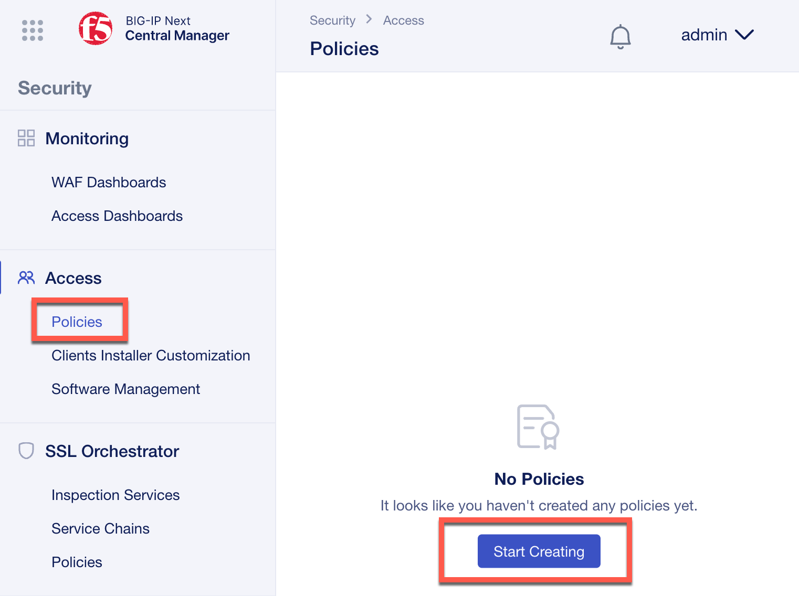
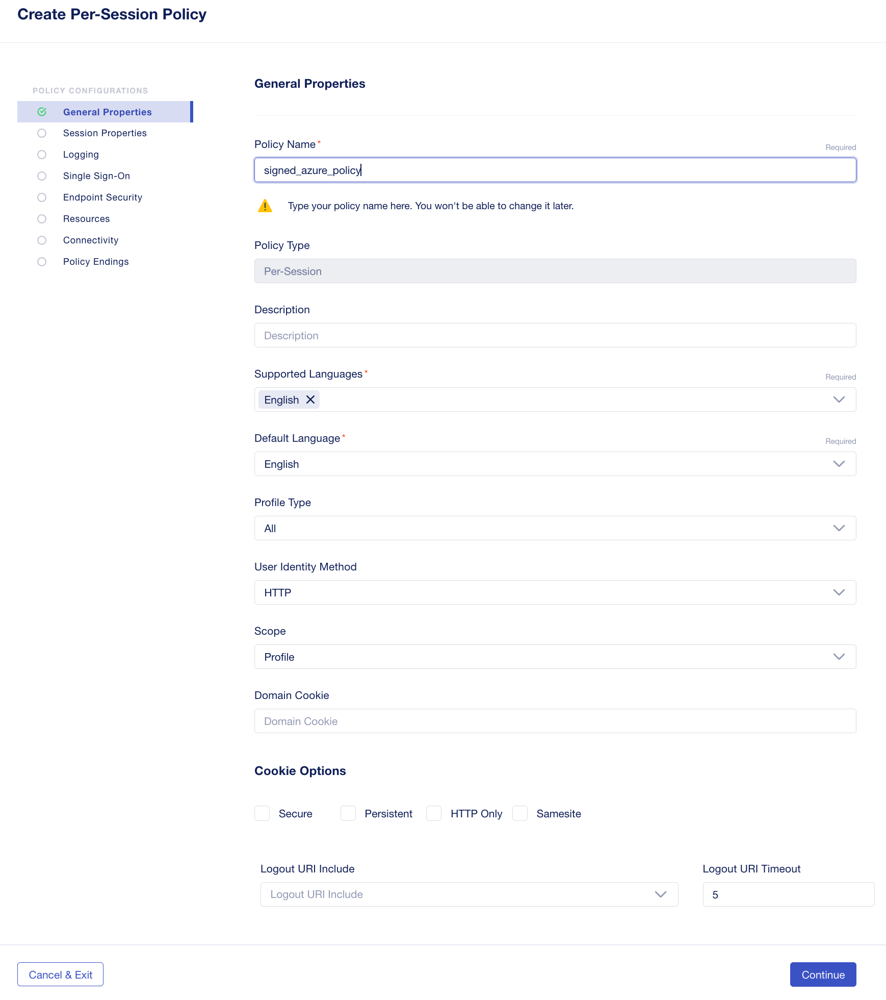
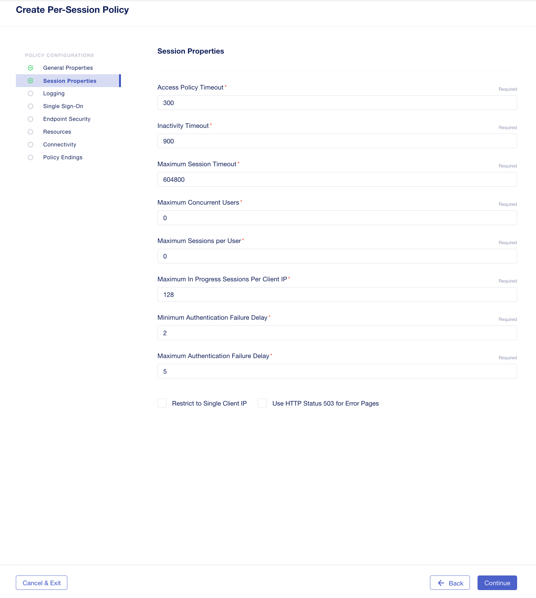
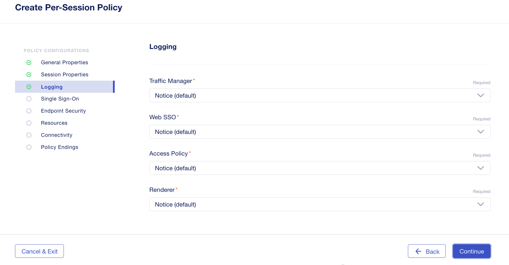
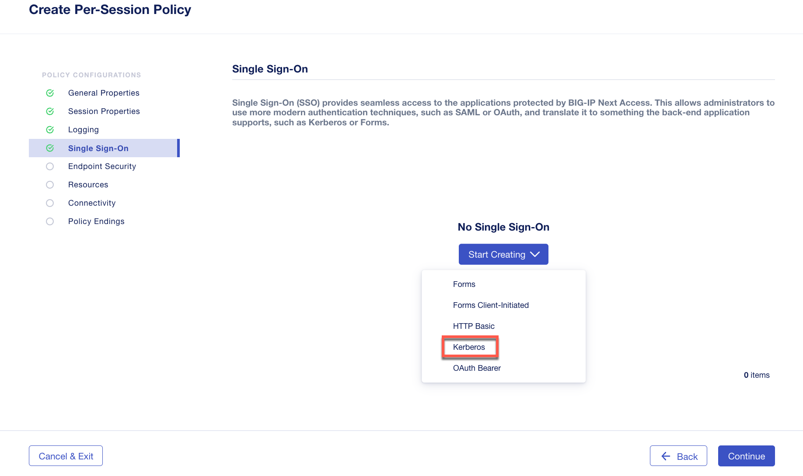
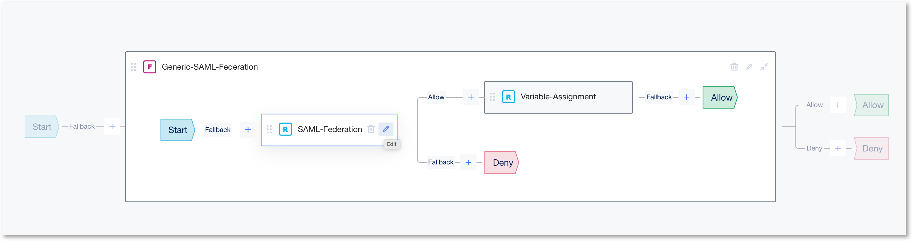

Lab 2.2 - Create an Access Security Policy
##########################################

Creating a security policy with authentication to Azure and Kerberos Single Sign-On
***********************************************************************************

1. Access **BIG-IP Next Central Manager** if you're not already logged in.

.. image:: images/lab2-cmlogin.png
    :width: 600 px

2. Click on the Workspace icon and select Security

.. image:: images/lab2-securitybtn.png
    :width: 600 px

Click on the **Access** from the Security menu.

.. image:: images/lab2-accessbtn.png
    :width: 600 px

3. Click the **Start Creating** button to create a new Access policy, or the **create** button on top right corner.

4. This will open Access Visual Policy Design screen. Select **Per-Session** and **using a policy template**. Select template **SAML as Service Provider**

.. image:: images/lab2-selecttemplate.png
    :width: 600 px

5. In the **Create Per-Session Policy** screen, this is where you set the different properties of the policy, such as, logging, language, Single Sign On, etc… Let’s start configuring the policy by setting a policy name and policy parameters.

In the **General Properties** screen set the following parameters, for the rest of the settings you may leave it as default.

- **Policy Name:** signed_azure_policy
- Click **Continue** 

.. note:: As you continue the rest of the policy creation process, see the screen shot in each section for a visual example of the configuration.

6. In **Session Properties**, keep the default settings, click **Continue**

7. In the **Logging** screen, you may want to adjust the logging to debug for troubleshooting proposes. For this lab we will keep all the default settings.

8. In the **Single Sign-On** screen, is where you can configure Single Sign-On to your applications. In this lab we will setup Single Sign-On for Kerberos.

Click on the drop-down arrow on the **Start Creating** button and select **Kerberos**.

9. This will open the SSO Method Configuration screen. In this screen set the parameters as follow.

- **Name:** remove the trailing number and replace with **signed_azure_policy**. See image below as reference.
- **Kerberos Realm:** F5ACCESS.ONMICROSOFT.COM  
- **KDC:** 10.1.20.6
- **Account Name:** host/apm-deleg.f5access.onmicrosoft.com
- **Account Password:** F5twister$ 
- **SPN Pattern:** HTTP/%h@F5ACCESS.ONMICROSOFT.COM
- **Username Source:** session.saml.last.identity
- **User Realm Source:** session.logon.last.domain

.. image:: images/lab2-sso2.png
    :width: 600 px

10. Click **Continue**, this will take you back to the Policy Configurations screen. Click **Continue** on the next screen.

11. **Endpoint Security** screen, you can setup Endpoint Security such as ensuring the firewall is enabled on a client workstation before access is granted. In this lab, we will not use this feature. Click Continue. 

12. **Resources screen**, you can set additional capabilities and features such as Network Access, and Webtops in this screen. In this lab we will not use these capabilities. Click Continue.

13. **Connectivity** you can set the SSL VPN (Network Access) connectivity settings. Keep as default and click **Continue**

14. **Policy Endings**, you can define addition policy ending logic as needed for your use case here. In this lab we will accept the default. Click Finish.

15. After clicking on **Finish** it should bring you back to the **Create Policy** screen. Now, we will use the Visual Policy Designer (VPD) to continue building the policy.

In Next Access we have two terms in the Visual Policy Designer (VPD); **Flows** and **Rules**. We set the Flows in the Visual Policy Designer (VPD) and within each Flow we can define multiple Rules.

.. image:: images/lab2-vpd-flow.png
    :width: 600 px

16. As we use a template, the **flow** is already there. We must configure it now.

17. Click on the **Collapse** button to see the content of the **flow**. You can see 2 rules.

.. image:: images/lab2-flowrules.png
    :width: 600 px

18.  Edit inside the **SAML-Federation** Rule box

This will open the SAML Federation Rule properties screen. Please follow the images below for each section.

19.  In the **SAML Rule Properties** configuration, replace the trailing number in the Name field to **azure_signed_policy**. Leave the **Provider Configuration** as **Basic**. Click **Continue**.

.. image:: images/lab2-ruleprop1.png
    :width: 600 px

20. In the **Rule Configuration**, **Providers** screen, this is where you can configure Service Provider and Identity Provider. A generic SP is already set. **Edit** it

- **EntityID:** https://mbip-1.f5access.onmicrosoft.com 
- **Host:** https://mbip-1.f5access.onmicrosoft.com 
- **Security Properties:** check the box for **Want Signed Assertion**

.. image:: images/lab2-serviceprovider.png
    :width: 600 px

21. Click on **Start Creating** under Identity Provider. In the **Add Identity Provider** screen input the following information, and then click **Save**.

- **Name:** remove the trailing number, and replace with **azure_signed_policy**
- **EntityID:** https://sts.windows.net/8807dced-9637-4205-a520-423077750c60/  
- **SSO URL:** https://login.microsoftonline.com/8807dced-9637-4205-a520-423077750c60/saml2  
- **Identity Provider’s Assertion Verification Certificate:** click the drop down arrow, and select the *azure_signed_cert*

.. image:: images/lab2-identityprovider.png
    :width: 600 px

22. After you click **Save** this should take you back to the Rule Configuration Screen, click **Continue**.

23. In the **Branches** screen, keep the default. Click **Finish**.

24. **Save** the policy and close the VPD by clicking on **Exit**.

You have completed creating an security policy!

