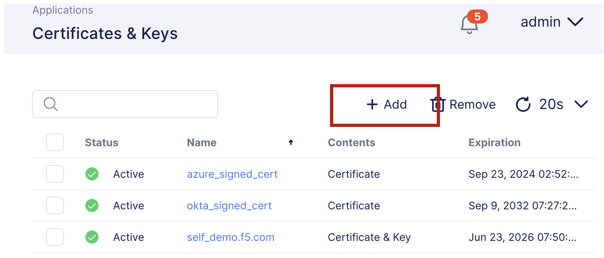
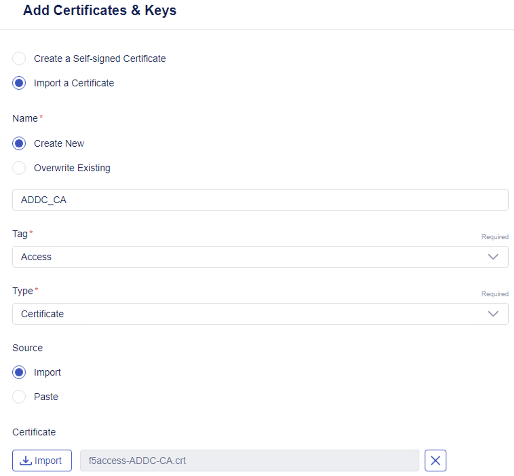

Lab 3.1 - Creating a Certificate
################################

Create a certificate in Next Central Manager
********************************************

1. Access **BIG-IP Next Central Manager** if you're not already logged in.

.. image:: images/lab3-cmlogin.png
    :width: 600 px

2. Click on the Workspace button and select **Application**. 

.. image:: images/lab3-app1.png
    :width: 600 px

3. Click on **Certificate & Keys**

.. image:: images/lab3-certkeysbtn.png
    :width: 600 px

4. Click on **Add** button to add a certifcate. 

5. In the **Add Certificate & Keys** fly out menu 

- Select the **Import a Certificate**. 
- Under **Name**, select **New**, and type: **ADDC_CA**
- In the **Tag** drop down box, select **Access**
- In the **Type** drop down box, select **Certificate**
- In the **Source** section, select **Import**
- In the **Certificate Section**, click on the **Import** button, and import the **f5access-ADDC-CA.crt** certificate
  
.. note:: The certificates are in the Access Lab folder in Documents as well as pinned to the Windows Explorer Quick Access

The result should look like the image below.

1. Click **Save**

You have successfully uploaded a certificate. 

