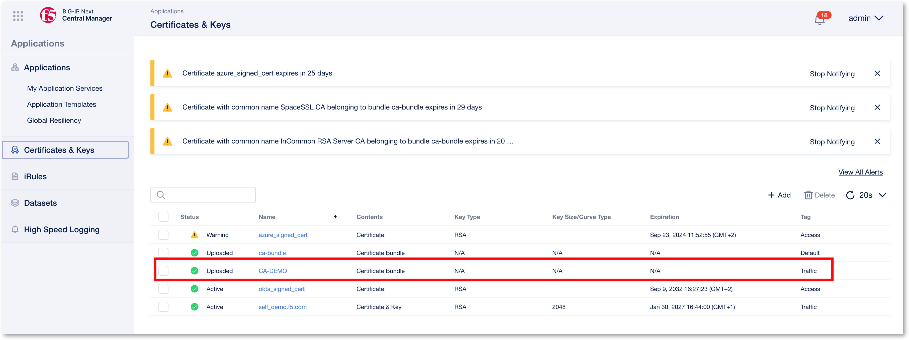

Lab 3.1 - Check CA Certificate
##############################

In your lab environment, a Certificate Authority is already up and running. The CA certificate has been added into BIG-IP Next CM.

* In Applications menu, and Certificates & Keys sub-menu, check the certificate list
* You can see the CA certificate called CA-DEMO

* Click on ``CA-DEMO``
  
  * You can notice the object is a ``Certificate Bundle``, and not a certificate
  * You can see details of the CA

.. note:: This CA will be used to validate the client certificate presented by the browser. This CE has been imported and trusted into the client browser.

