Lab 3.3 - Create an Application
###############################

Creating an application and assign an Access policy to the application
**********************************************************************

1. Access **BIG-IP Next Central Manager** if you're not already logged in.

.. image:: images/lab3-cmlogin.png
    :width: 600 px

2. Click on the Workspace icon and select Application.

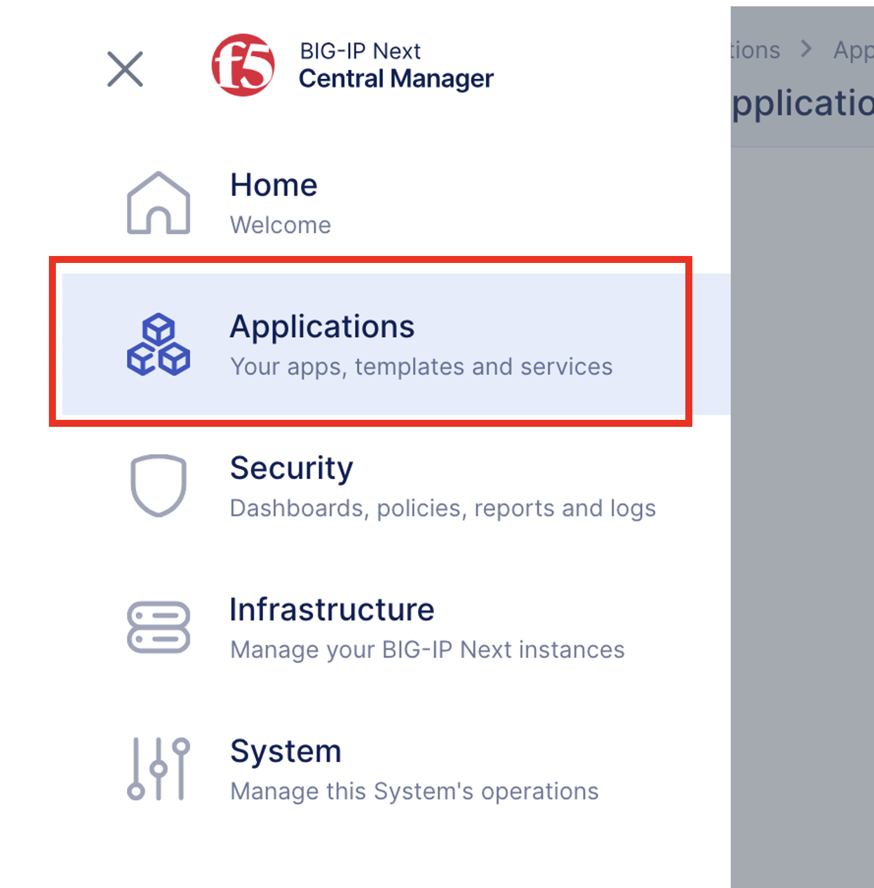

3. Click on **Start Adding Apps** button to create an Application.

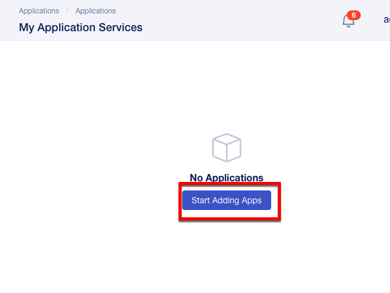

4. In the **Add Application** screen, set the following parameters:

- In **Application Service Name** type: *cert_app*
- Under **What kind of Application Service are you creating?**: select Standard
- Click on **Start Creating** button

.. image:: images/lab3-createapp1.png
    :width: 600 px

5. In the Application Services Properties, click **Start Creating**.

.. image:: images/lab3-createapp2.png
    :width: 600 px

6. In the Virtual Servers configuration screen, we will define the Pool first, so click on **Pools** tab, click **Create**, and type in **Pool Name:** cert_auth_pool.

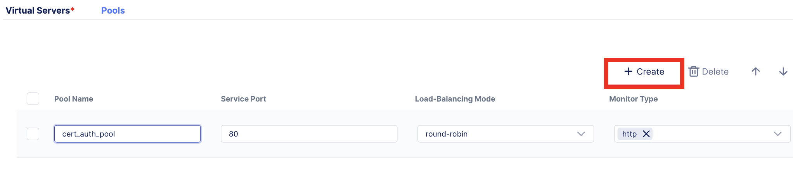

7. Switch to the **Virtual Servers** tab. Now let’s define the Virtual Server properties.

- **Virtual Server Name:** vs_cert
- **Pool:** cert_auth_pool
- **Virtual Port:** 443

.. image:: images/lab3-createapp4.png
    :width: 600 px

8. Click on the **Edit** button under **Protocols & Profiles** to enable HTTPS 

9. In the **Protocols and Profiles**, tick the slider button for **Enable HTTPS (Client-Side TLS)**. This will enable the features under HTTPS.

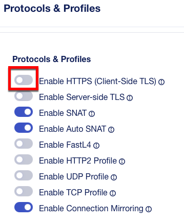

10. Click on the **Add** button to create a new client ssl profile, and add the following information

- **Name:** client-cert-auth
- **RSA Certificate:** self_demo.f5.com
- Click **Continue**

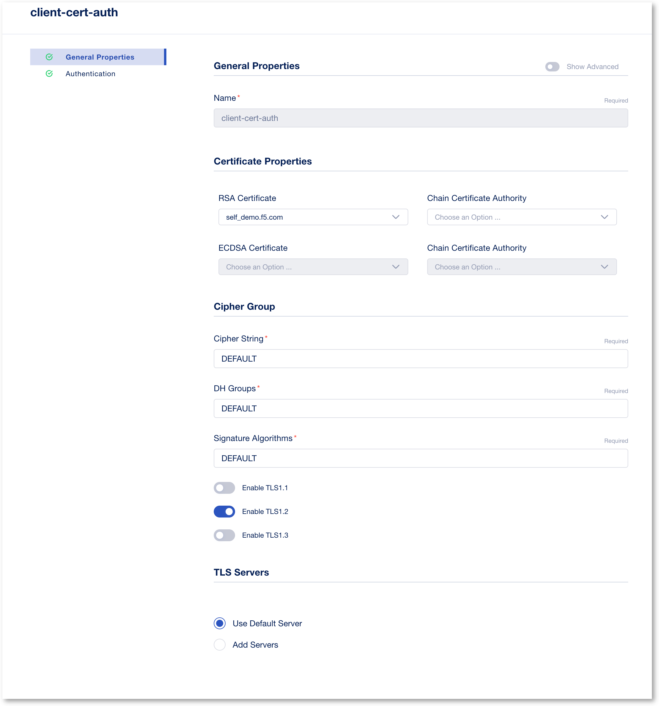

11.  In Authentication menu, **Enable Authentication** with the following information

- **Client certificate authentication mode** : Request
- **Trusted Certificate Authorities** : xca-demo
- Click **Save**

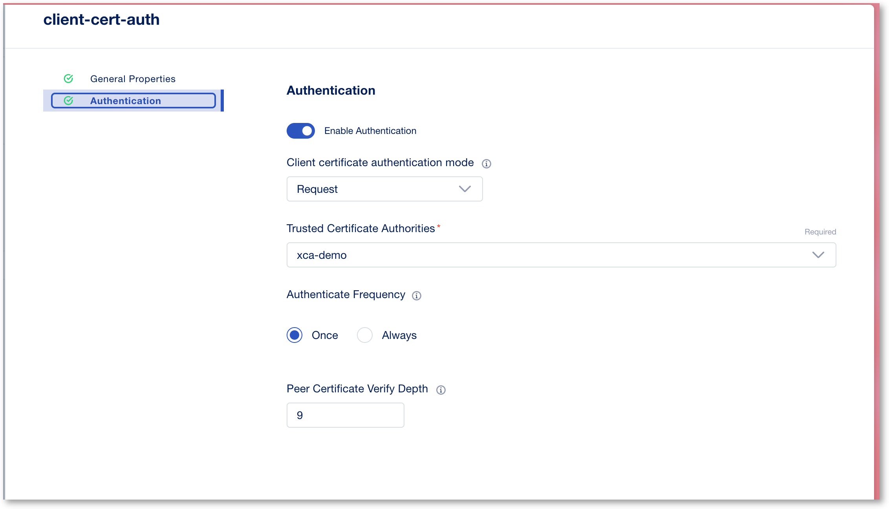

12.   This will take you back to the **Protocols and Profiles** screen. Enable the **HTTP Profile**. Click **Save**. 

.. image:: images/lab3-http-profile.png
    :width: 600 px

14.  This will take you back to the **Virtual Server** screen. Now we will attach the Access Policy we created previously to this application. Click on the **Edit** button under Security Policies.

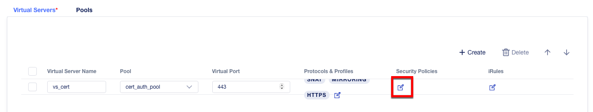

15. This will open the **Security Policies** screen. Slide the button next to **Use an Access Policy**. Under **Specify the Access Policy for this Application**, click the drop-down box and select the **certAuth** created previously. Click **Save**.

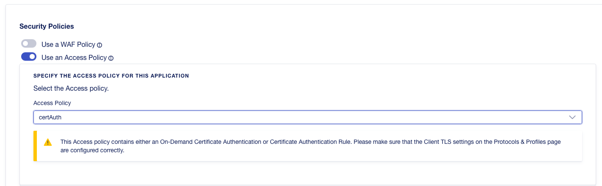

16.  After clicking **Save**, you should be returned to the Virtual Server property page. Click on **Review & Deploy** at the bottom right-hand corner.    

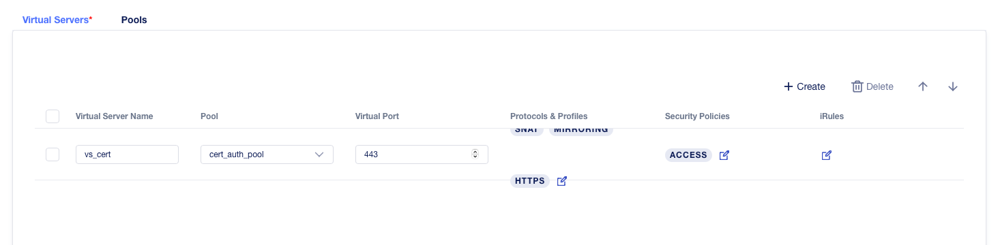

1.  In the **Deploy** screen, this is where you define which BIG-IP Next instance to deploy the application. Click on **Start Adding** to select a BIG-IP Next Instance.

.. image:: images/lab3-deployto.png
    :width: 600 px

18. In the drop down box, select *big-ip-next-03.example.com*, then click on **Add to List** button.

.. image:: images/lab3-deployto2.png
    :width: 600 px

19. In the **Virtual Address:** box type: **10.1.10.112** to associate with the virutal server vs_cert. 

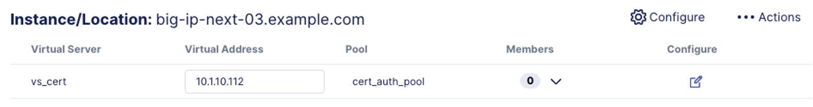

20.  Click on the drop down arrow under the Members column. This is where you can add the backend pool members to the virtual server. 

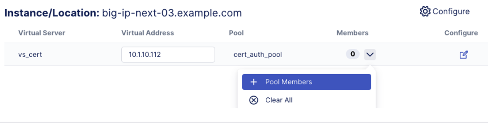

21. In the cert_auth_pool screen, click on **Add Row**, and enter the following information for the pool member.

- **Name:** be_cert_auth
- **IP Address:** 10.1.20.6
- Click **Save**

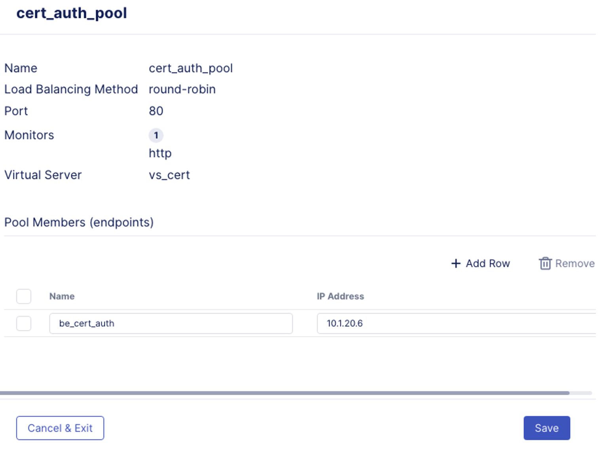

1.  Now you’re ready to Deploy your application. Click on **Deploy Changes** at the bottom right-hand corner.

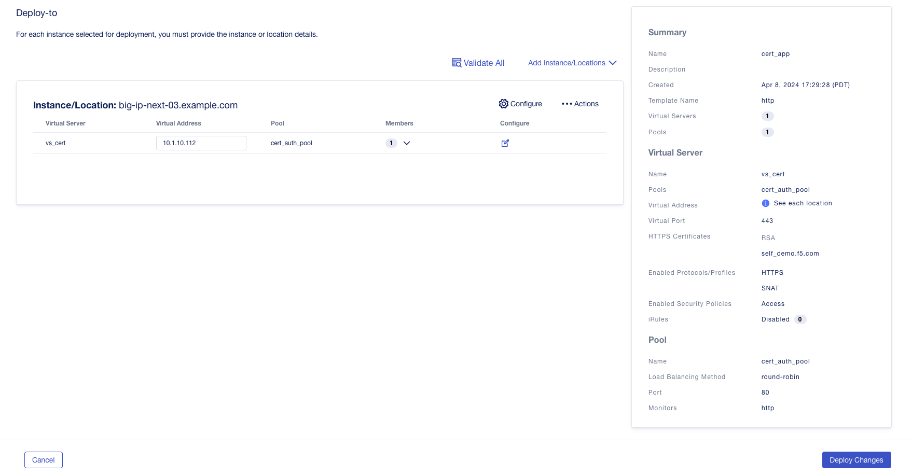

1.  Confirm in the pop-up window that you’re deploy to *big-ip-next-03.example.com* instance.

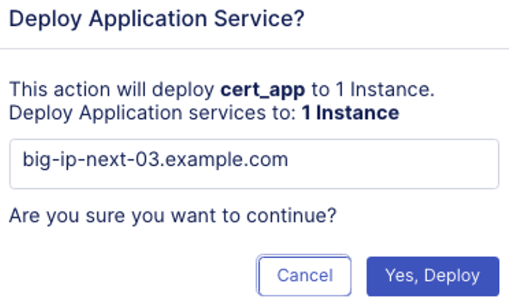

Click on **Yes, Deploy**

23. You will get a status pop up window, and after a few seconds the screen should refresh and show you the My Application Service dashboard, with a confirmation that Deployment Complete.

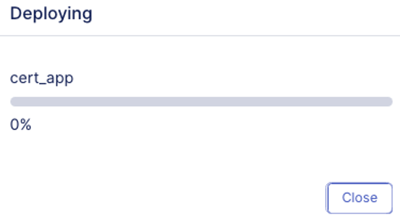
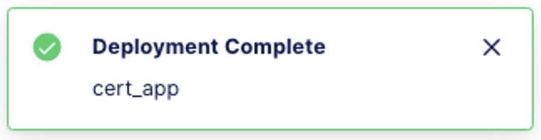

24. My Application Services Dashboard should show you one application has been deployed, and Health is Good. 

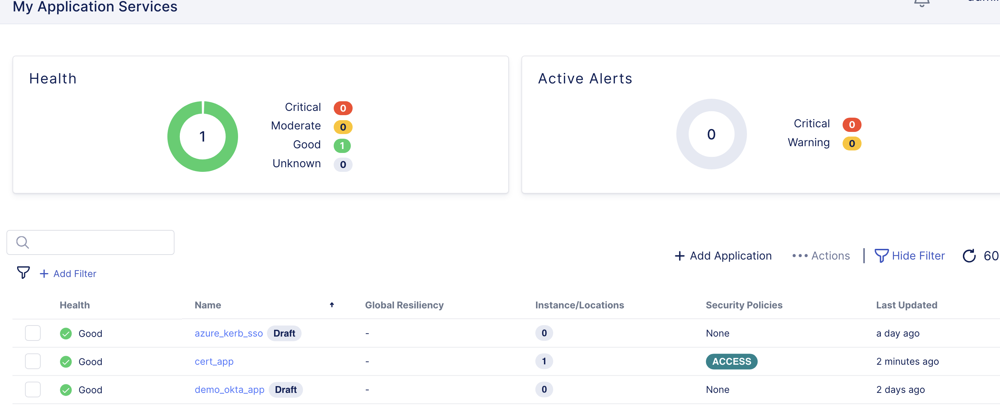

You have successfully created an application and assigned an access policy to it. Let's test the application!

