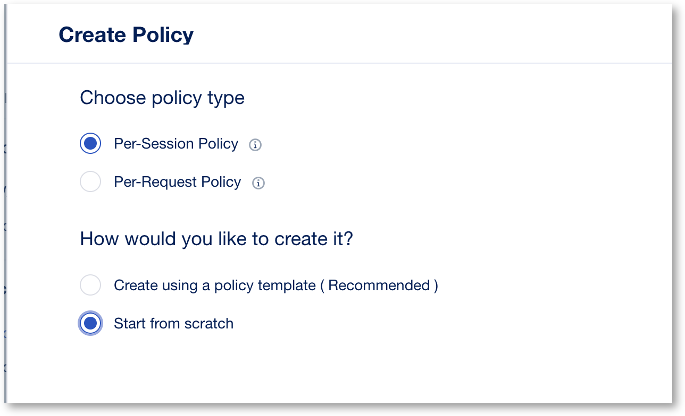
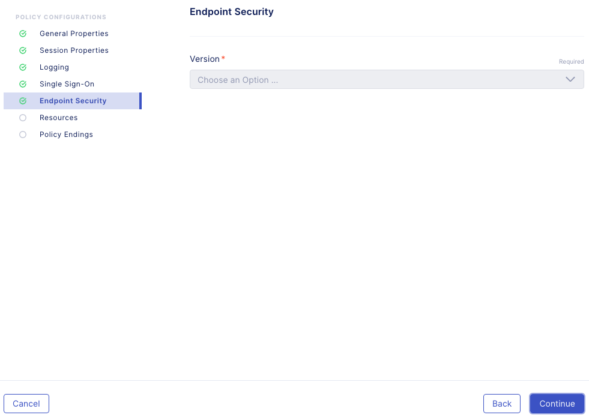
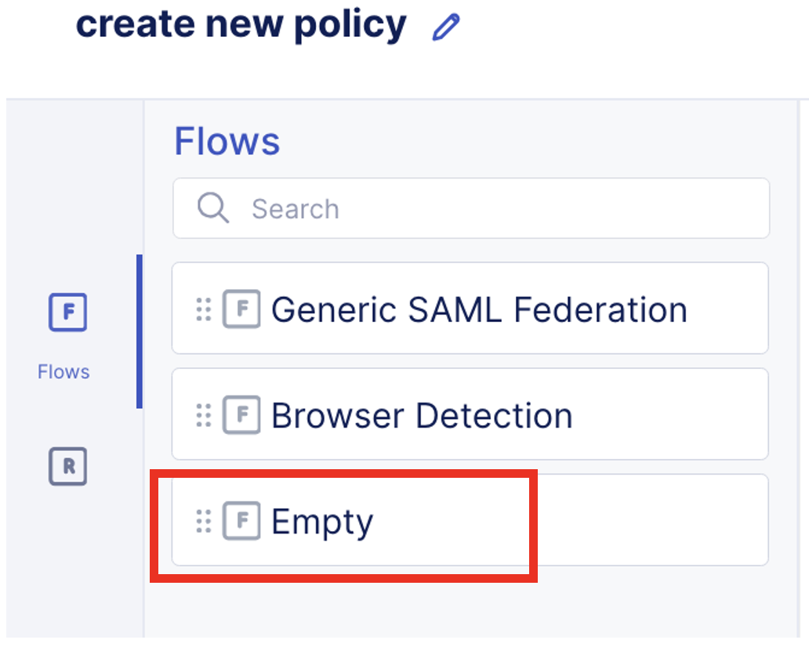
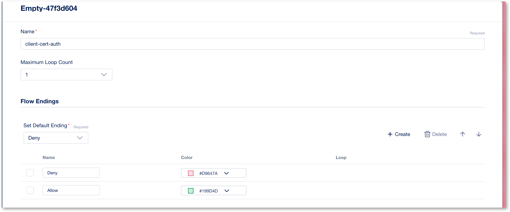
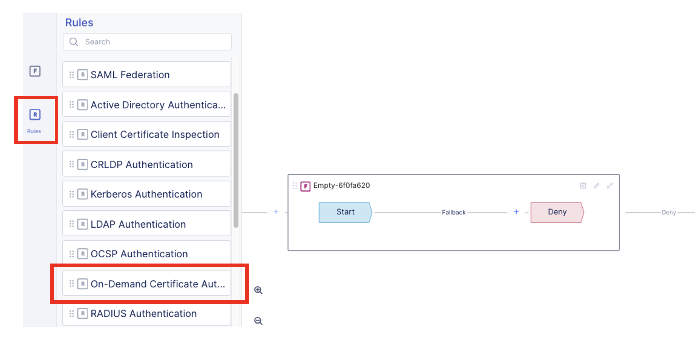
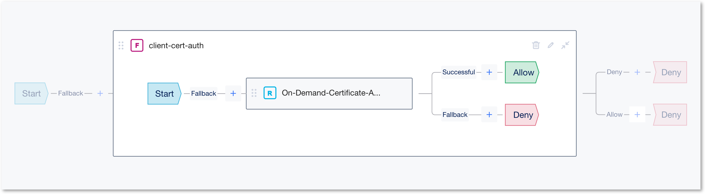
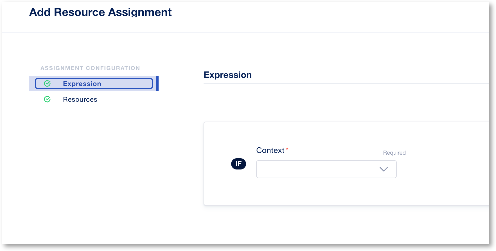
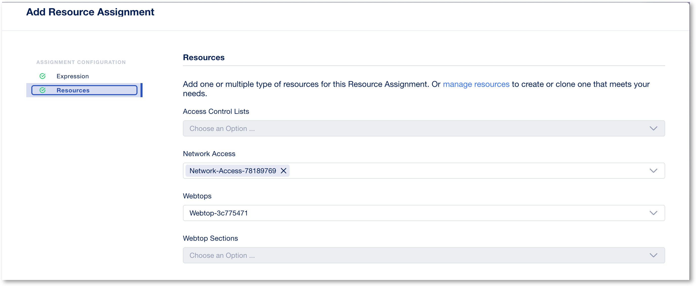

Lab 1.1 - Create an Access Security Policy
##########################################

1. Access **BIG-IP Next Central Manager** if you're not already logged in.

.. image:: images/lab1-cmlogin.png
    :width: 600 px

2. Click on the Workspace icon and select Security

.. image:: images/lab1-securitybtn.png
    :width: 600 px
    
3. Click on **Access** from the Security menu, this should default to Policies.

.. image:: images/lab1-accessbtn.png
    :width: 600 px

4. Click **Start Creating** button to create a new Access policy, or click on **Create** if you have already several policy created.

.. image:: images/lab1-createapbtn.png
    :width: 600 px

5. This will open Access Visual Policy Design screen. Choose a **Per-Session Policy** and **Start from Scratch**, click Next

6. In the **Create Policy** screen, this is where you set the different properties of the policy, such as, logging, language, Single Sign On, etc… Let’s start configuring the policy Start Selecting policy name and adjust policy parameters.

In the **General Properties** screen set the following parameters, for the rest of the settings you may leave it as default.

- **Policy Name:** ssl-vpn
- **Cookie Option:** check the **Secure** box
- Click **Continue** 

.. note:: As you continue the rest of the policy creation process, see the screen shot in each section for a visual example of the configuration.

7. In **Session Properties**, keep the default settings, click **Continue**.

.. image:: images/lab1-session.png
    :width: 600 px

8. **Logging screen** you can adjust the logging level to help with debugging or troubleshooting. For this lab we will keep the default settings. Click **Continue**. 

.. image:: images/lab1-logging.png
    :width: 600 px

9. **Single Sign On** screen, you can set the Single Sign On configuration with an IDP. For this lab we will not use any SSO. Click **Continue**.

.. image:: images/lab1-sso.png
    :width: 600 px

10. **Endpoint Security** screen, you can setup Endpoint Security such as ensuring firewall is enabled on a client workstation before access is granted. For this lab we will not use this feature. Click **Continue**.

11. **Resources** This is where we will create the Networkl Access resource and also the Webtop resource.

* Click **Start Creating**, and create a **Network Access** resource. Configure as below

  * Change to split tunneling

    .. image:: images/lab1-networkaccess.png
       :width: 800 px

  * Give a name to the lease pool : leasepool1
  * DNS/Host, set IPv4 primary Name Server to : 10.1.20.6
  * Click **continue** till end and **Finish**

* Click **Create** and create a new resource type **Webtop**

  * Keep default settings
  * Finish

12.  Click **Continue** to continue to **Connectivity**. We will set the SSL VPN (Network Access) connectivity settings.  

* **Edit** the BIG-IP Edge Client config

  .. image:: images/lab1-edgeclient-conn.png
     :width: 600 px

* **Add** a new Server List entry

  * Alias: next-vpn
  * Host Name: vpn.example.com

    .. image:: images/lab1-serverlist.png
       :width: 600 px

  * Click **Finish** and **Continue**

13.  **Policy Endings** you can define additional policy ending logic as needed for your use case here. For this lab we will accept the default. Click **Finish**.

.. image:: images/lab1-policyendings.png
    :width: 600 px

After clicking on **Finish** it should bring you back to the Create Policy screen. Now, we will use the Visual Policy Designer (VPD) to build the policy.

.. image:: images/lab1-createpolicy2.png
    :width: 600 px

14. Under **Flows**, drag and drop **Empty** flow to the VPD. You will need click on the little dots to the right of the flow type to grab the flow and drop into the VPD. 

When dropping the flow type onto the VPD, you will want to make sure the flow type box is over the plus sign and the plus sign turns blue.

.. image:: images/lab1-emptydd.png

The result should look like the following screen shot.

.. image:: images/lab1-emptyok.png
    :width: 600 px

15. Click inside the Flow type box. This show 3 buttons; **Delete**, **Edit**, and **Collapse** buttons. Click on the **Collapse** button to start adding Rules to the Flow and Editing settings.

.. image:: images/lab1-allthebtns.png
    :width: 600 px

16. Click on the **pen** to edit the Empty box. Change the name to **client-cert-auth** and add a new ending branch called **Allow**

17. On the left hand side menu, select the **R** (Rules) button, and scroll down on the **Rules** till you find **On-Demand Certificate Authentication**.

17. Click and drag **On-Demand Certificate Authenticate** to the VPD.

.. image:: images/lab1-rules2.png
    :width: 600 px

18. Edit the **On-Demand Certificate** rule by clicking on the edit button.

.. image:: images/lab1-rules3.png
    :width: 600 px

19. In the **Rule Configurations**, **Rule Properties**, change **Authentication Mode** to **Require**. Click **Continue** and **Finish**

.. image:: images/lab1-rules4.png
    :width: 600 px

20. Change the **Deny** ending of the successful branch by the **Allow** ending

21. Add a new rule **Advanced Resource Assign** next to the Successful branch, **edit** it, and add your **webtop** and **network access** resources.

* Do not select any context, keep it empty
* Add your webtop and Network Access

* Click **finish** and save your Advanced Resource Assign rule (by clicking to **continue**).

22.   Click on the **Collapse** button to close the **Rules and Flow** box so you’re back to the main VPD. S

23. On the **Allow** branch, change the ending to **Allow**.

.. image:: images/lab1-final-allow.png
    :width: 600 px

24.  **Save** the policy and close the VPD by clicking on **Exit**.

You have completed creating a security policy. Next we will deploy an Application and assigned the access policy. 