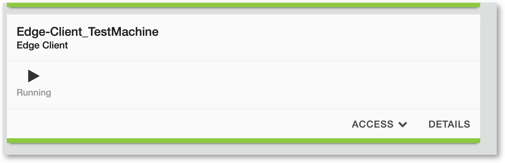

Lab 1.3 - Test Application
##########################

Test Connectivity to Application through SSL VPN with Edge Client
*****************************************************************

1. Open an RDP session to Edge-Client_TestMachine VM 

.. warning:: This is another VM. Don't use the VM used in previous labs

1. Open Edge Client and click **Connect** (Edge Client will minimize to the task bar)

2. Open Firefox and navigate to http://10.1.20.6

3. You should see the F5 Demo App.

This concludes the Lab - SSL VPN