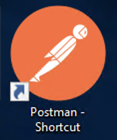
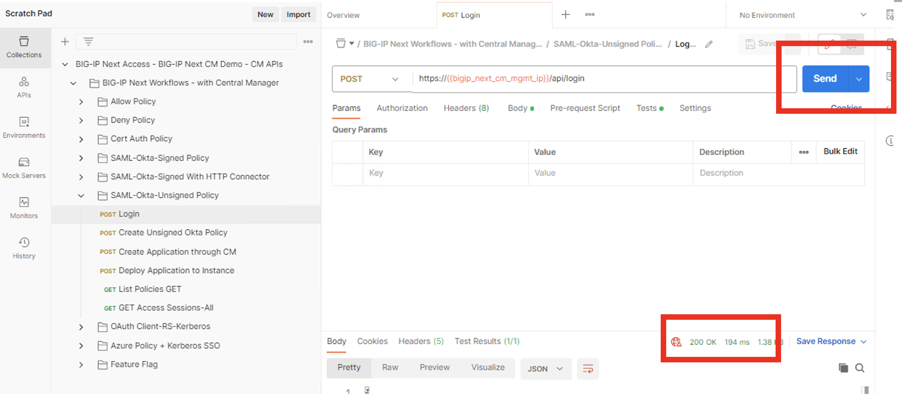
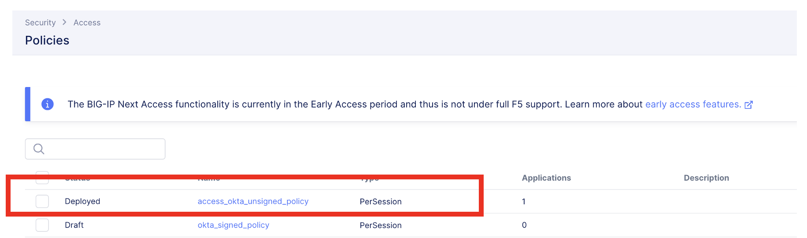
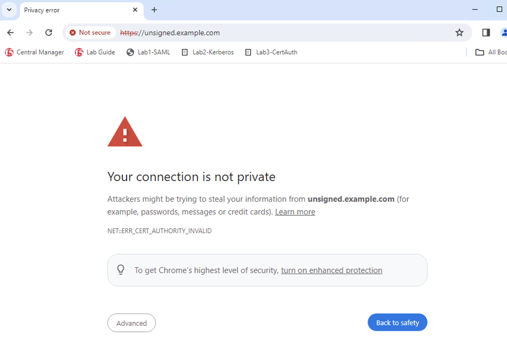
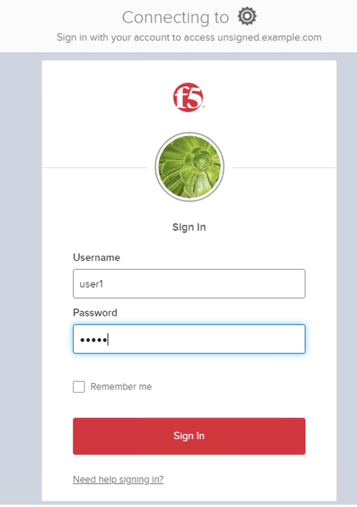

Lab 1.1 - Next Access through API
#################################

Deploy an Access policy and deploy to an application through API call
*********************************************************************

1. Open Postman on the Desktop

2. In Postman, you should see the BIG-IP Next Access collection, expand the collection. 

3. Next you'll see BIG-IP Next Workflows Collection, expand the collection. 

4. Next there will be list of collections for the different use cases in Next Access. Today we will work on SAML-Okta-Unsigned-Policy collection. Click on the collection to expand it. 

.. image:: images/lab4-postman2.png
    :width: 600 px

5. For this lab we will run the following API requests. 

- Login
- Create Unsigned Okta Policy
- Create Application through CM 
- Deploy Application to instance
- List Policies GET

To run the request, click on the **Request**. In the example below we using Login request but you will want to follow the same process for all the requests listed above.

.. image:: images/lab4-postman3.png
    :width: 600 px

Click on the blue **Send** button. A successful API request will return a 200 OK code.

Please click **Send** for all the requests above. If you run into a problem, please ask a lab assistance for help.

6. Next, log into Central Manager if you're not already logged in or have been logged out. 

.. image:: images/lab4-cmlogin.png
    :width: 600 px

7. Click on the Workspace icon and select Security

.. image:: images/lab4-securitybtn.png
    :width: 600 px

8. Click on **Access** from the Security menu.

.. image:: images/lab4-accessbtn.png
    :width: 600 px

9. This should automatically default to **Policies**. Look under Policies, you will noticed a new policy **access_okta_unsigned_policy** has been created and in **Deployed** status. 

10.  Click on the **Workspace** icon and select **Application**.

.. image:: images/lab4-app1.png
    :width: 600 px

11. This should automatically display **My Application Services** dashboard. Noticed a new application **access_okta_unsigned_app** has been added, and in Good Health. 

.. image:: images/lab4-app2.png
    :width: 600 px

12. Let's test this application!! Proof is in the pudding right?

13. In Chrome browser, type the following URL: https://unsigned.example.com

You will get a certificate warning. You can safely continue and ignore the certificate warning. 

14. When prompted for Okta authentication enter the following username/password: user1/user1

You should see the F5 Demo App after a successful login. 

.. image:: images/lab4-end.png
    :width: 600 px

You have completed Lab 4. Isn't this the fastest Access policy deployment lab?? 

